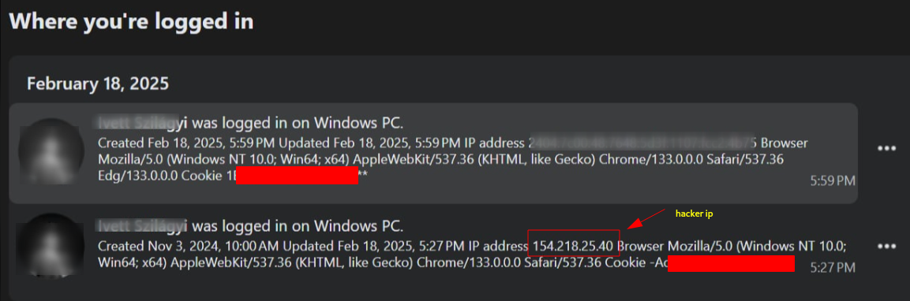
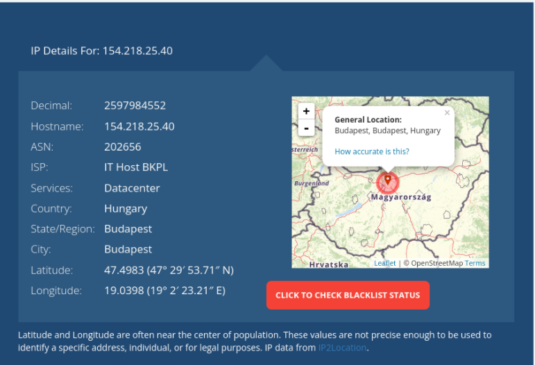
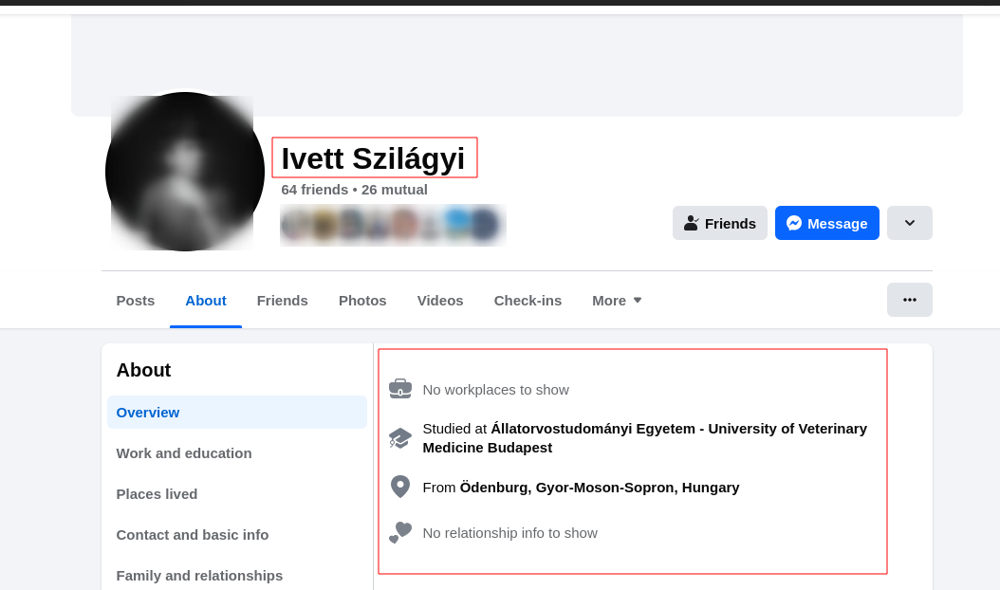

### Background

I was chilling in my workspace, solving TryHackMe challenges, when one of my friends sent me a video. In the video, I saw that one of our mutual friend's Facebook accounts had been compromised. 
A minute later, the friend whose Facebook had been hacked called me. I asked him what had happened, and he simply told me that he had been logged out of Facebook and no longer had access.I advised him to try recovering his Facebook account by resetting the password. I also reported to Facebook that my friend's account had been hacked and informed other friends to report the incident as well.

### Recovery
A few minutes later, my friend called me to say that his account had been recovered because he had access to his recovery email, phone, and even backup codes. After recovering his Facebook account, we talked on a video call and started investigating what had actually happened and how his account had been compromised. 

### Investigation
As part of the investigation, I asked my friend a few questions, such as:

- Did you click on any links?
- Did you log in to any site that looked like a Facebook login page?
- Did you share your login credentials with anyone?
- Did you receive any login alerts or Facebook password change notifications in your email?

And all his answers were 'NO.' I was amazed when I heard that he had even enabled 2FA and login alerts on Facebook, yet didn’t receive any OTP or alert when his account was compromised. I was even more amazed that the hacker didn’t change the email or phone number associated with the account.

### Conclusion 
After some investigation, we found the following evidence and concluded that it was nothing other than cookie theft. Here are the reasons that led to this conclusion:

1. The hacker logged in from Hungary with the IP address 154.218.25.40, and when we tracked the IP, it was indeed from Hungary.

2. The hacker did not change the email or phone number, did not perform any activities that required a password, and only changed information that didn’t require a password.

The hacker changed the profile picture, but when we performed a reverse image search, it was easily found on Google.

3. Facebook did not send any login alerts and didn’t ask for an OTP for 2FA because this was not a new login. The hacker stole our cookie and used it, so Facebook recognized them as the same person.

Facebook doesn't require a password to change the name, so the hacker changed my friend's name. Even after we got the account back, it took 60 days to change the Facebook name. Facebook should implement a password requirement feature for changing the name.

To confirm the hypothesis, I tried the same thing on my account. I have two accounts, and I copied the cookies from my primary account to my secondary account. I was successfully able to access the primary account on another device, and I even changed the name of the primary account. There was not a single notification from Facebook.

### Possible reason behind cookie theft 

According to the conversation between me and my friend, he claimed that he hadn’t clicked any suspicious links or shared his credentials. However, he had downloaded some pirated Windows applications and visited a site that was marked as unsafe. We’re not sure how our cookie was stolen, but this could be the reason.

### Safety measures 
To be safe from cookie theft and account takeover, follow these measures:
1. Use Secure website (HTTPs Only)
2. Enable login Alerts and 2FA.
3. Store backup codes for account recovery in safe place.
4. Don't visit untrusted sites .
5. Donot download pirated applications and .apk files.
