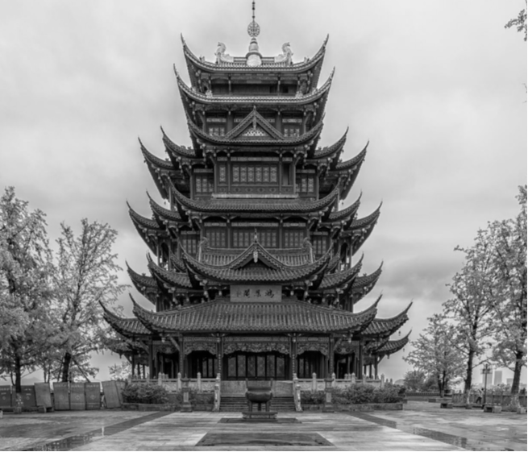
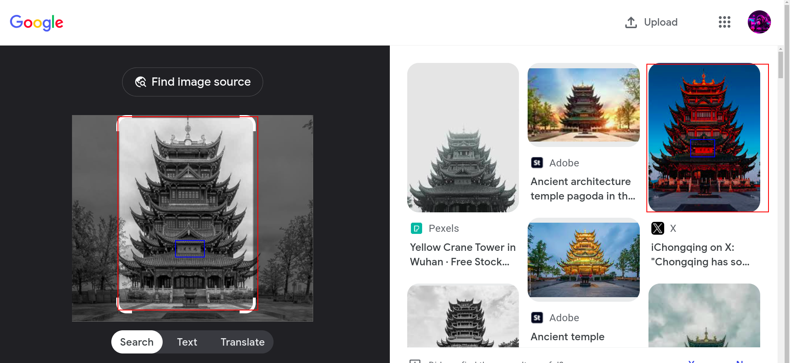
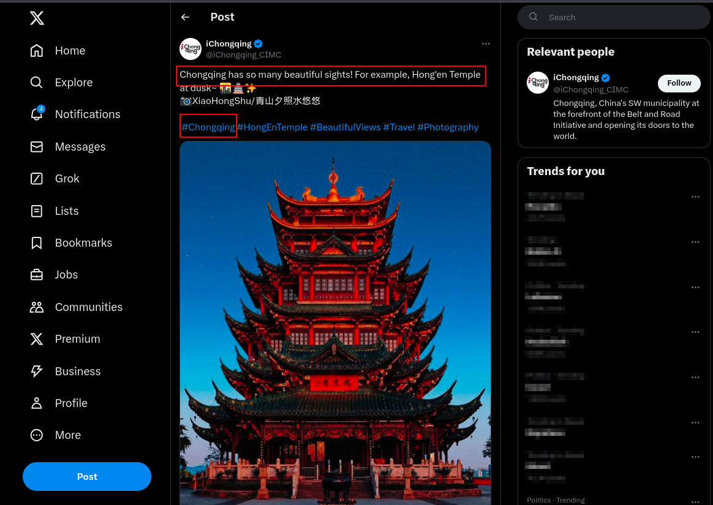
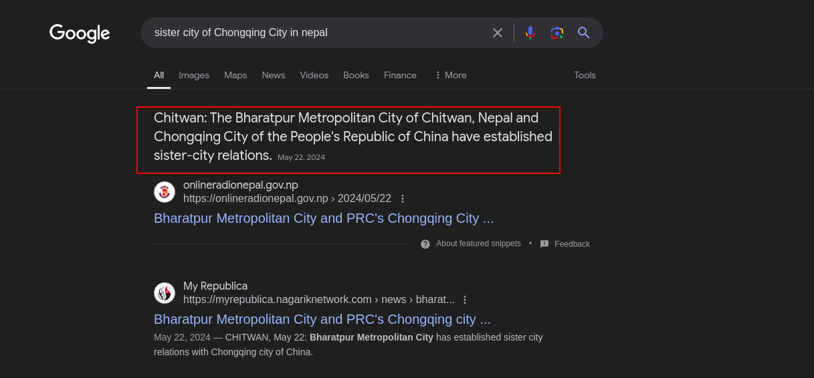
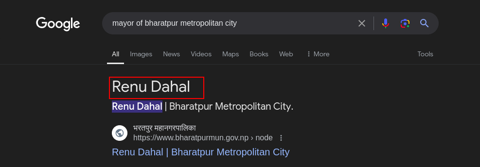

Bhagini Sahar is the CTF challenge related to OSINT hosted by [NCA@Nepal](https://ncateam.xyz/about/). NCA@Nepal is an active CTF and cybersecurity community in Nepal. A short description and image are provided in the challenge.



Whenever we need to find the geolocation of an image, we can use Google Image Search, Yandex, or Bing. I used Google Images to gather information about the above image, and I discovered that it is located in Chongqing, China




Now we need to find out the sister city of Chongqing, which is located in Nepal, and the name of its mayor.



After gathering all the info we need , we finally got the flag:
```nca{chongqing_bharatpur_renu_dahal}```
