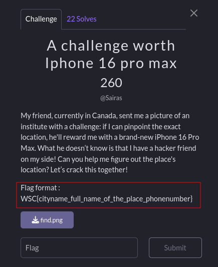
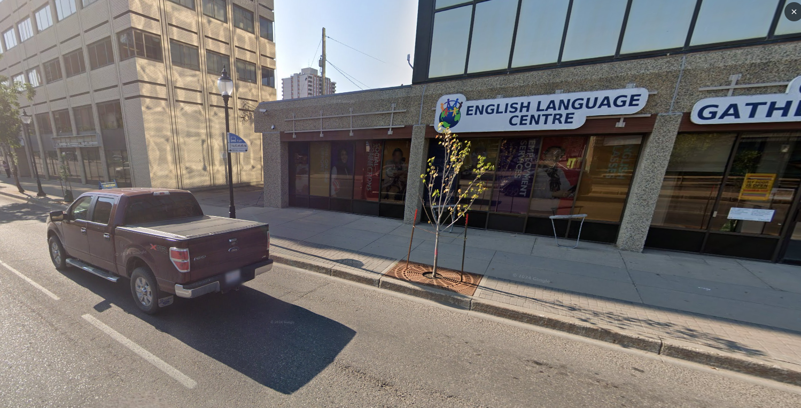
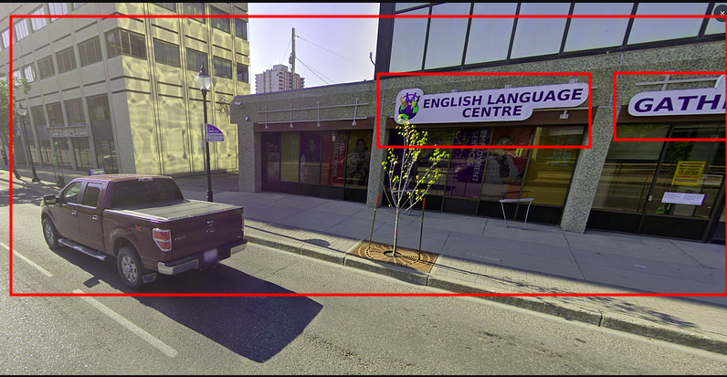
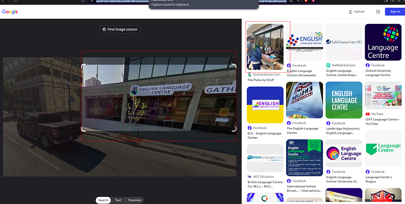
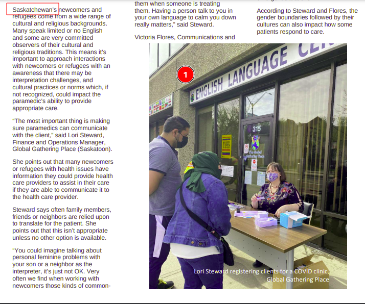
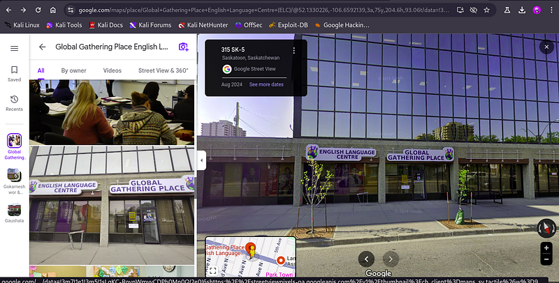
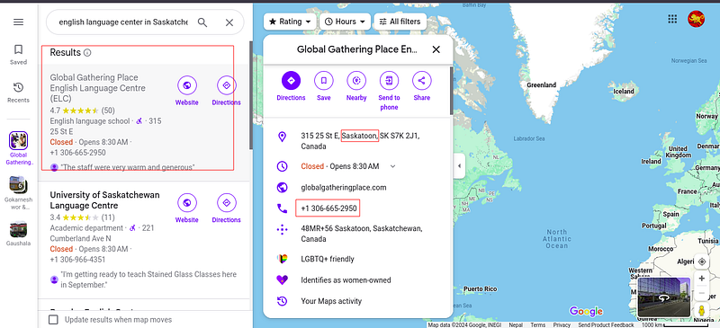

Recently, I got the chance to play the WSC CTF challenge organized by **We Shield Cyber** and sponsored by **NCA Nepal** and **Hack@sec**. There was an OSINT challenge titled *"A Challenge Worth iPhone 16 Pro Max"* with a description and an image provided.

## Description:
```
My friend, currently in Canada, sent me a picture of an institute with a challenge: if I can pinpoint the exact location, he'll reward me with a brand-new iPhone 16 Pro Max. What he doesn’t know is that I have a hacker friend on my side! Can you help me figure out the place's location? Let’s crack this together!

Flag format : WSC{cityname_full_name_of_the_place_phonenumber}

```

## Image:


As per the description, we need to find the city name, the full name of the place, and the phone number. Let's show the power of OSINT.



We can see enough hints in the above image to gather information about the building and its location. I tried searching this image in Google Image Search and found a photo that looks similar to the one provided in the challenge.



I opened the link and found a PDF. When I checked the PDF, I found some clues about the place.
[Pdf file](The-Pulse-February-2023.pdf)



Then, I searched for “English language center in Saskatchewan” and got many results. The image provided in the challenge had the text "GATH," so I selected the first option. After analyzing the information provided by Google, I saw there was an option to view the location using 360-degree street views.






We have gathered all the information needed to solve the challenge. Now, the final flag for the challenge is:  

  ```WSC{Saskatoon_Global_Gathering_Place_English_Language_Centre_+13066652950}```
  