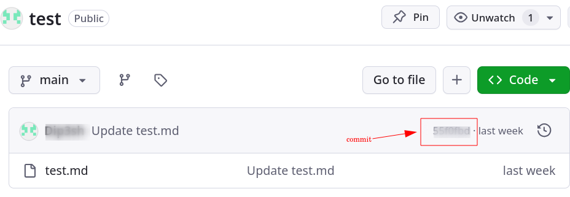
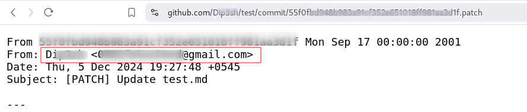

## Introduction:
GitHub is one of the most significant and widely used tools by IT professionals and developers. It serves as an essential platform for version control and code backup, enabling seamless collaboration and teamwork.

Developers and programmers often place blind trust in GitHub when deploying their code. However, misconfiguration has become one of the biggest emerging issues in the security of the digital world.

## How Emails are Exposed
GitHub has a default feature that can expose your email address to anyone. While this is not a vulnerability, GitHub does offer an option to hide your email. However, many users are unaware of this setting. Let’s explore how your email can be revealed and how to prevent it from happening.

Now, let's visit the repository of the target whose email you want to check. Click on any commit, and you'll see the full commit URL in your browser's address bar. To reveal the email address, simply add .patch to the end of the URL, and you'll be able to see the associated email address.

## How to Hide your Email
To prevent your email from being exposed, follow these steps:

1. **Go to github settings** : Click on your profile picture in the top right corner and select "Settings."
2. **Navigate to Emails**: Under the "Emails" section, check the option to **Keep my email address private**.
3. **Enable Email Privacy**: Select the box that says "Block command line pushes that expose my email."
4. **Use a GitHub-Provided Email**: You can also choose to use a GitHub-generated email address (e.g., `username@users.noreply.github.com`) to keep your personal email address hidden while still contributing to public repositories.

By enabling these features, you can ensure your email address remains protected and avoid unintentional exposure.
