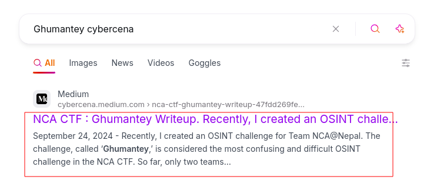
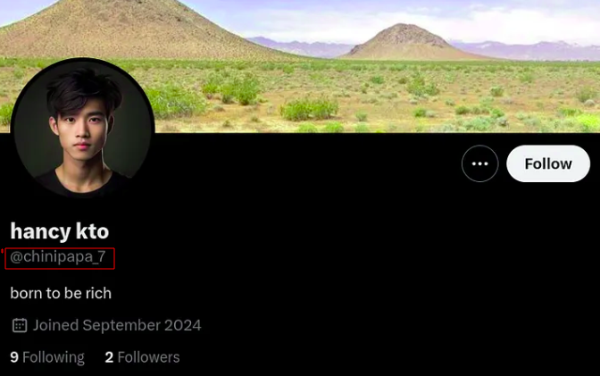
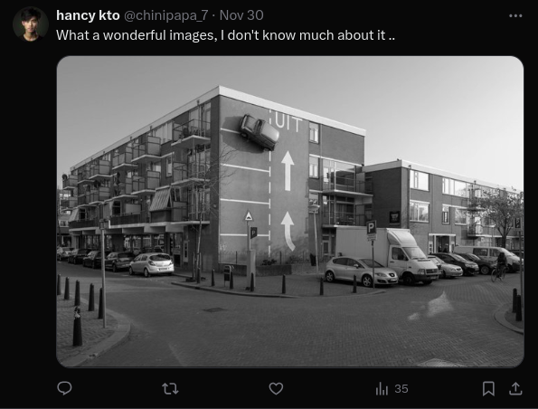
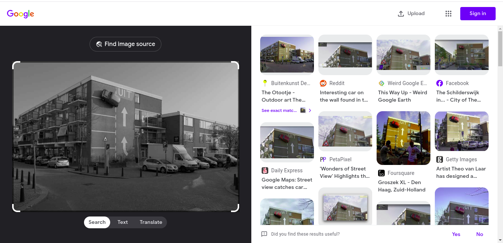
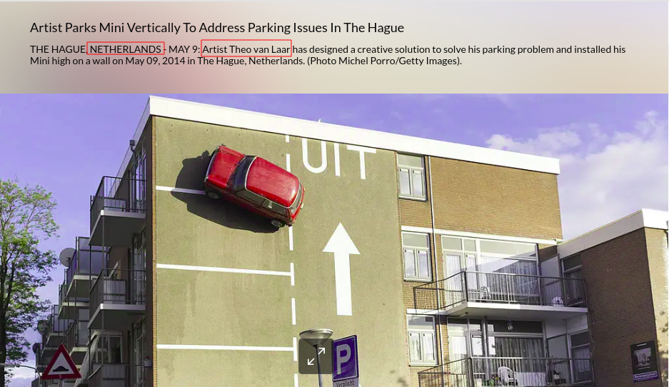
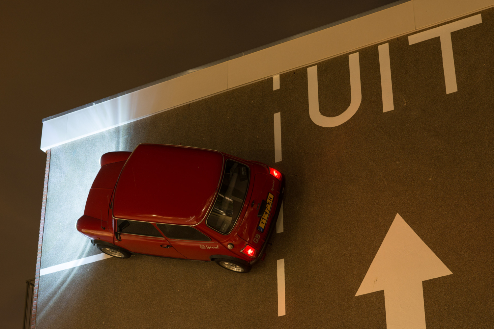

 
## Description:
```
Last time, you guys helped me win the brand-new iPhone 16 that my friend promised me. I received the iPhone 16 because you solved the 'ghumantey' puzzle. This time, my friend has promised me a MacBook. Recently, he visited a new place and uploaded a photo on his social media. Can you help me to won macbook?

flag format : WSC{username_Country_Artist_Name_Car_Number}
```
In the description, the challenge is suggesting they have a challenge, 'Ghumantey' in previous CTF and asking us to find the username of his friends and other details.

## what we need ?
```
1.username of friend
2.Country name
3.Artist's name
4.Car Number
```
## Solution :

I started with google search and find out there is a writeup of Ghumanytey challenge organized by [NCA Nepal](https://ncateam.xyz/) . 



i visit the [URL](https://cybercena.medium.com/nca-ctf-ghumantey-writeup-47fdd269fee0) and I found username of his friends and twitter [Twitter handle](https://x.com/chinipapa_7).





Now we can use Google image searching for finding information about the car.






now finally , we got the flag: ```WSC{chinipapa_7_Netherlands_Theo_Van_Laar_YT-47-KR}```