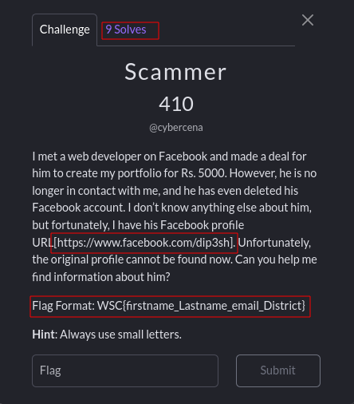
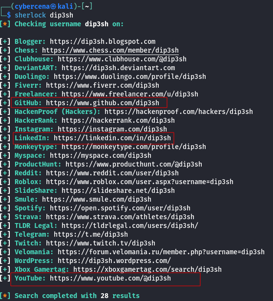

Recently I have create a osint Challenge, 'Scammer' for WSC CTF . Here is Writeup for the challenge.

## Description:
```
I met a web developer on Facebook and made a deal for him to create my portfolio for Rs. 5000. However, he is no longer in contact with me, and he has even deleted his Facebook account. I don’t know anything else about him, but fortunately, I have his Facebook profile URL[https://www.facebook.com/dip3sh]. Unfortunately, the original profile cannot be found now. Can you help me find information about him?

Flag Format: WSC{firstname_Lastname_email_District}

Hint: Always use small letters.
```
The only info we had is the facebook link which is used to be the Scammer's account but that username was used by another people right now. 

[Note: username "dip3sh" is just used because it is same as the github username used in Challenge.]

We can collect the account name with specific username using tools such as **Sherlock** and [whatsmyname](https://whatsmyname.app/). i used sherlock.

The scammer is pretending as web developer so he might be using popular site such as twitter(X), github and linkedin etc. so we have to focus on that.


 
there is a github account with the scammer's username , i visit scammer's github and got some important hints and information.


we got Scammer's email address now lets move to find out other information. we can checkout Scammer's linkedin and youtube but we are not sure either he is scammer or not.

[Note: you will not found Scammer's linkedin becuse it was suck poppet established for the challenge.]

we can visit youtube link , may be we can get some fruitful info there. We got a video where scammer had upload screen recording related to his linkedin account. we got the info such as his name and an image with status "Remote work from hometown".


now let's osint the image and find out the scammer's district name. I always prefer to use Google image search for Geo-oisnt. We are unable to get exact match so let's analysis the image, we can see structure like umbrella , statue and small dharara in the picture.

the final flag is : 
```
WSC{deepesh_gurung_dip3sh0000@gmail.com_makawanpur}
```


