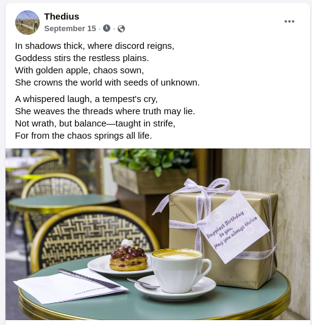
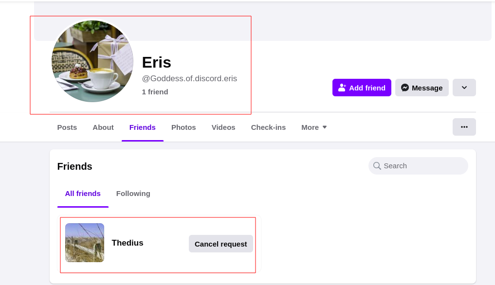

## Description:
```
Dear agents, It is come to our attention that the two possible spies we were to search for, have gone into hiding. It may not be a quick and easy task but it IS our duty to seek out their hideout location. We know the information we have right now is quite little but we have faith in you to not make us disappointed

Note: Spy1 
Alias: Thedius
Age: 24 
Gender: male 
Social media: https://www.facebook.com/thedius.665152?mibextid=ZbWKwL

Spy2 'met thedius before disappearance'

Flag format: wsc {name_of_the_sation, city} for example: Wsc{baedehi, itaharwa}
```

## Solution:

when visiting the URL, I got the birthday post from spy1 and in the image there is a something written in book cipher.

```
0:8:1 0:6:3 0:2:1 0:4:7 0:1:5
```




the book cipher was written in format of page:line:words.
I decode book cipher from the poem and got,
```
For the Goddess of discord
```
I don't know what it means so i search about it in the google and found that goddess of discord is Eris. I searched, 'Eris' in the facebook and got a facebook profile who is also a friend with spy1, thedius:


while stalking profile of eris , I found github account of eris and i started to visit github. there was a github repo ,'DearDiary'

```
https://github.com/Goddess-of-discord/DearDiary.git
```
there is two files, i just cloned that repo and start investigating files. 
```
binwalk -e diary.jpg
```
```
                                                                                                                            
┌──(cybercena㉿kali)-[~/Desktop/DearDiary]
└─$ cd _diary.jpg.extracted
                                                                                                                             
┌──(cybercena㉿kali)-[~/Desktop/DearDiary/_diary.jpg.extracted]
└─$ ls
16sep24  17sep24  18sep24  19sep24  20sep24  26184.zip file.zip
                                                                            
┌──(cybercena㉿kali)-[~/Desktop/DearDiary/_diary.jpg.extracted]
└─$ cat *sep24  
I met Thedius a while ago. 
He has some weird and new ideas constantly going on his head. Some of those ideas were genius but others were blatantly bizarre. 
He speaks half the time in Latin phrases, and makes cult and sacrifices look beautiful. 
He talks about politics and gods with all the enthusiasm but has his faith in neither. 
And now He has disappeared into thin air since we last met. He left behind a file with a note

" dear eris,,
i am going away for a while. 
i am afraid i can't Tell you where, tHough you'll eventually figurE it out (and i hope you'll have it figureD out soon. I really need you hEre). 
don't tell a soul about thIs. my abSence will be reported soon and Cops will be on their seArch. 
make your way to uS before cop can geT you, won't you? "

I don't know what to make of that note. am afraid he is involved in something dangerous...
Knowing Thedius, am pretty sure the password to the file is some of his nonsensical phrases in dead languages. but which one??
still stuck on that note....
This is starting to give me a headache now
I got it! I got it!! I got it!! Can't believe the password was there in the note all along. Oh dumb me.
Now I'll head off to join them right away
```

now we have to unzip the zip file but we don't have password.
after reading the text files i got some hint such as,"non sensical phrases" and I saw strange pattern in the message and when i gathered it i got :
```
THEDIEISCAST 
```
which can be pronounced as ``` THE DIE IS CAST```. since eris often uses latin pharse, i tried chatgpt for the meaning of The Die is cast and got ```iacta alea est``` which is also available in Ad meliora text file in git so , I tried it as password.

```
┌──(cybercena㉿kali)-[~/Desktop/DearDiary/_diary.jpg.extracted]
└─$ unzip file.zip
Archive:  file.zip
[file.zip] file.txt password: 
  inflating: file.txt                
                                                                  
┌──(cybercena㉿kali)-[~/Desktop/DearDiary/_diary.jpg.extracted]
└─$ ls
16sep24  17sep24  18sep24  19sep24  20sep24  26184.zip  file.txt  file.zip
                                                                                                                                        
┌──(cybercena㉿kali)-[~/Desktop/DearDiary/_diary.jpg.extracted]
└─$ cat file.txt
Hi. I know I caused you quite the unrest but plz join us at Galma Sation in Wonsan. I'll explain it all to you when you arrive here. We are waiting for you.
```
 and the final flag was ```WSC{Galma, wonsan}```.
