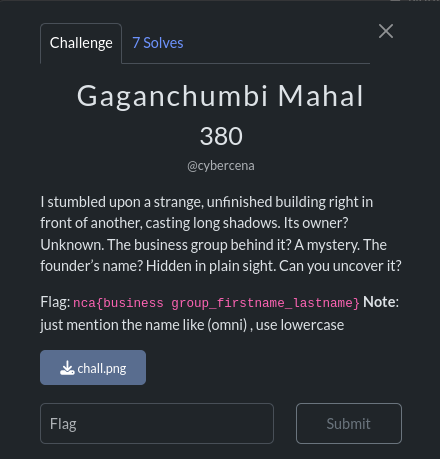
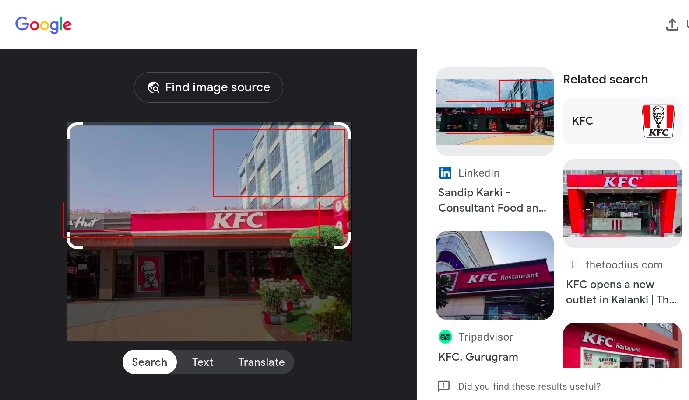
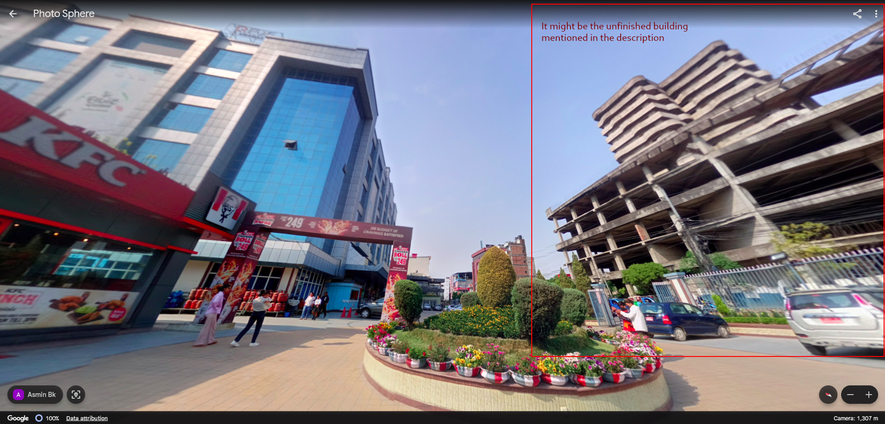
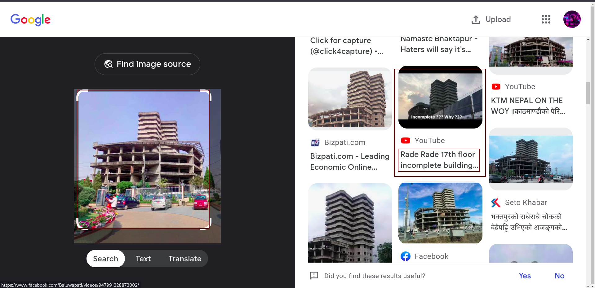
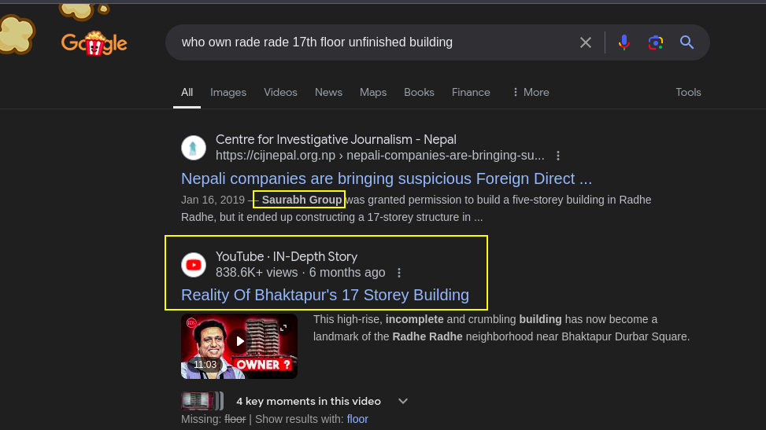

Gaganchumbi Mahal is an OSINT-related CTF challenge hosted by Team [NCA@Nepal](https://ncateam.xyz/about/). NCA@Nepal is Nepal’s active cybersecurity community and Capture The Flag (CTF) team, where learning and sharing knowledge are at the heart of everything they do. Their motto is 'Learn and Share: Growing Together in Cybersecurity'.

In the challenge, a short description and image were provided. You can see them in the image below:



Whenever we are solving the challenge, we need to carefully read the description and set a clear goal for what we need to find out. In the image above, the term 'unfinished building casting a long shadow' is mentioned. So, I began solving the challenge with the help of Google image search.I got the exact location of the place shown in the image.

It is Bhatbhateni located in Bhaktapur. To confirm the location, I used Google Earth for a virtual tour. Surprisingly, I found an unfinished building in front of the Bhatbhateni as well.


Now that we have the image of the unfinished building, our next step is to identify the business group that owns the building and find the first and last name of the group's founder.





I found multiple URLs, and I thought the YouTube video could be more useful. I was able to get all the information I needed from it. Alternatively, we can search Google for the founder of Saurabh Group.


So, finally we got the flag :
```
nca{saurabh_lila_neupane}
```
Note: Google image search , yandex/images , bing and google earth are mostly used in Geo-osint challenge.
