Recently, I created an OSINT challenge for Team [NCA@Nepal](https://ncateam.xyz/about/)
. The challenge, called ‘Ghumantey,’ is considered the most confusing and difficult OSINT challenge in the NCA CTF. So far, only two teams have solved it at last moment.

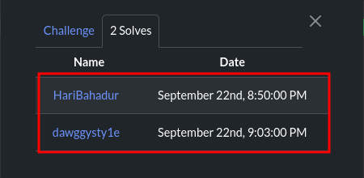

In the challenge, there is a short description and an image.
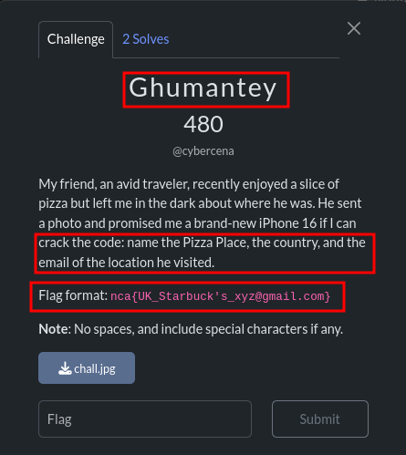
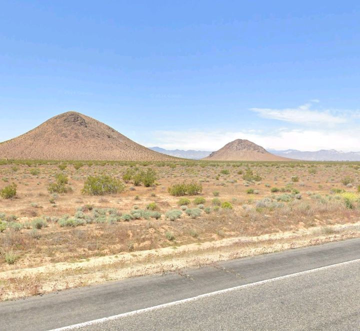

The image above is the one provided in the challenge. We have multiple choices to identify the location name. Participants can use image search tools such as Google Images, Yandex, Bing, etc., or check the image metadata using tools like exiftool or https://exif.tools/. In this case, I prefer exiftool over Google searching, and look what I found…

```
exiftool chall.jpg
```
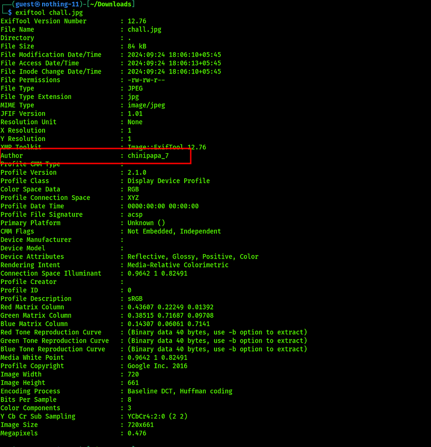

I found the author name ‘chinipapa_7’ in the image. Now, we can perform OSINT on the author name. We have multiple options, such as using tools like Sherlock or https://whatsmyname.app/. In this case, I preferred Sherlock because of its powerful capabilities, and look what I found…

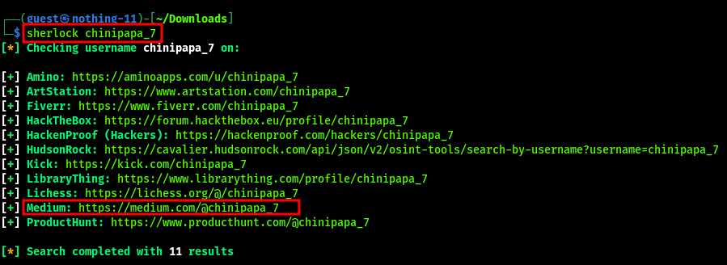

Among the multiple URLs found in the image, I discovered that https://medium.com/@chinipapa_7 could be useful because the description mentions a traveler, and travelers often use Medium for blogging. I visited the link and found a clue that can help us…

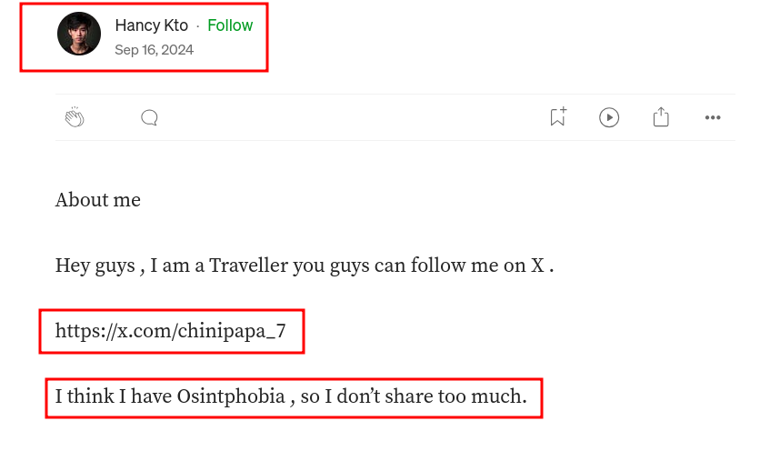

There is a hint for X, and the word ‘Osintphobia’ points towards the correct target. On Twitter, I found a profile with the same name, ‘Hancy Kto,’ and the username ‘chinipapa_7.

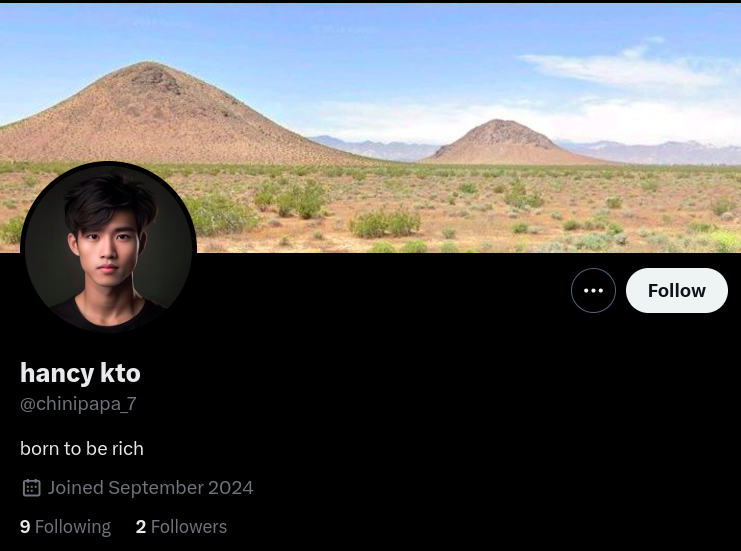
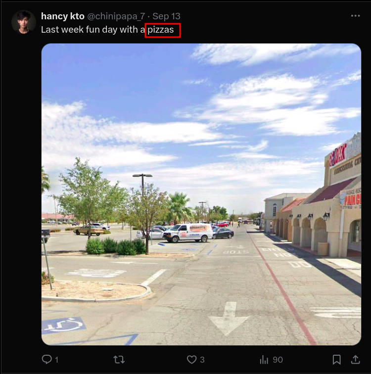
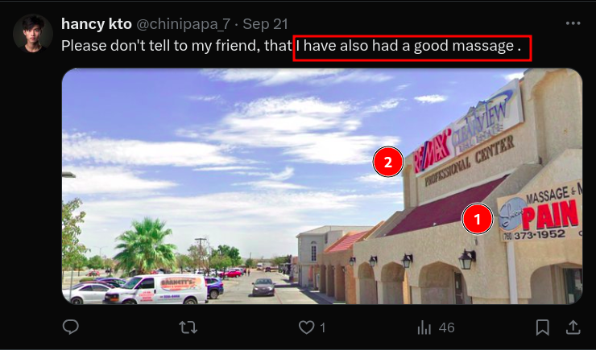

In the image, the words ‘pizza’ and ‘massage’ are mentioned, and there is enough information, such as the hoarding board of RE/MAX and Sharon’s Massage Center, along with a phone number. The phone number can help find the exact location, so I googled it.

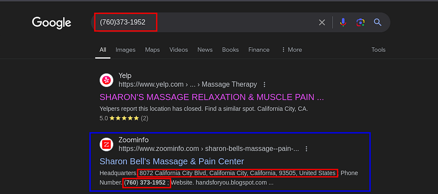

We found the exact location of Sharon’s Massage Center: 8072 California City Blvd, California City, CA 93505. Now we can use Google Earth for a virtual tour. It’s the best tool for an OSINT challenge.

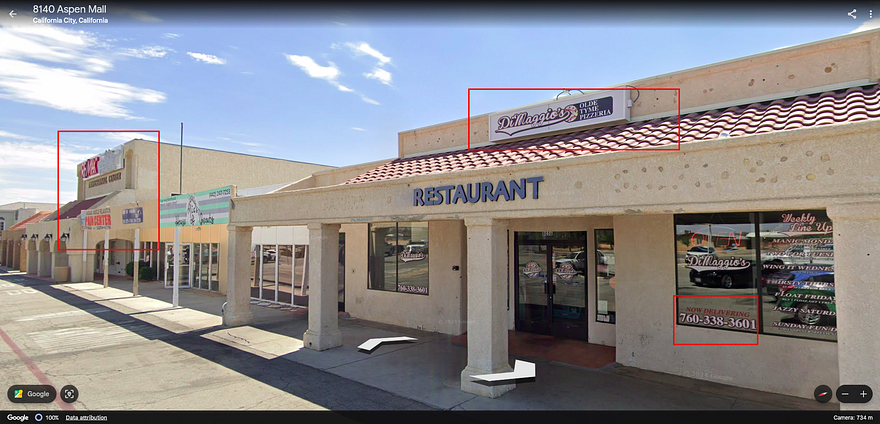
In the image, we can see the nearest pizzeria located near the massage center mentioned on Twitter, and the location looks the same. We have found the country name and the name of the pizzeria; now we need to find the email for DiMaggio’s. I think Google dorking will be the best for information gathering. I used: 
``` site:facebook.com "Dimaggio's" "California"```

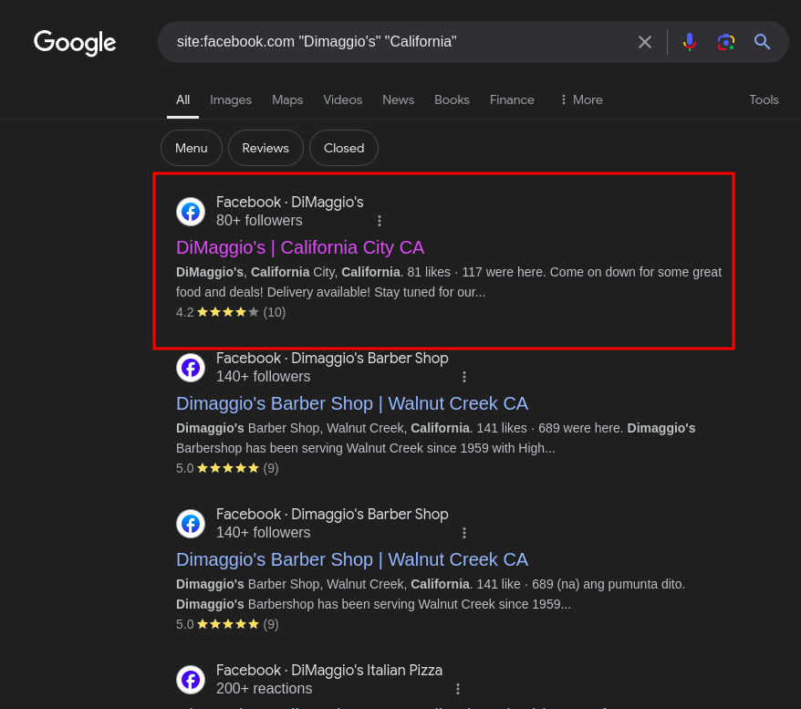

I can choose any social media platform for dorking, but I think Facebook is the best. I clicked on one of the links and found the email.

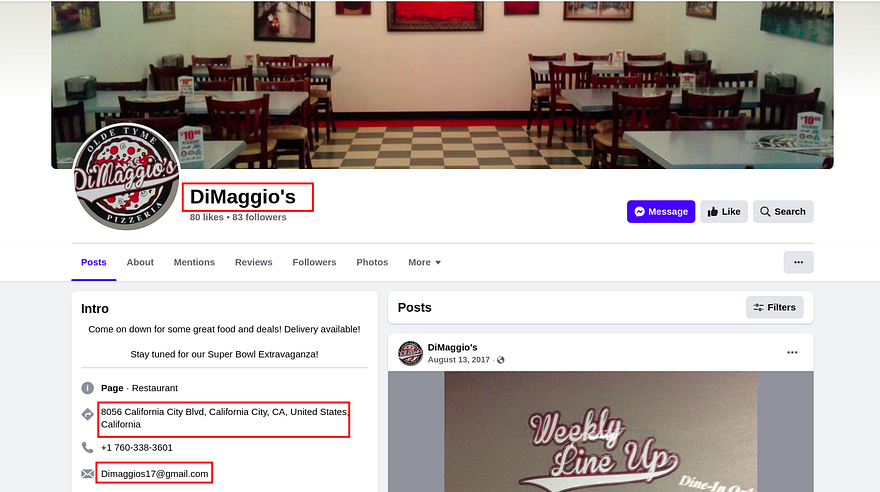
From all the info that we have collect , we got the flag that is :
```nca{USA_DiMaggio’s_dimaggios17@gmail.com}```


