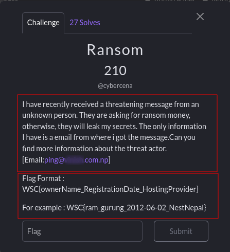
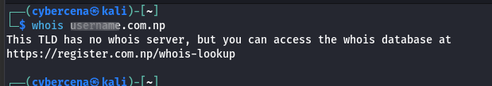
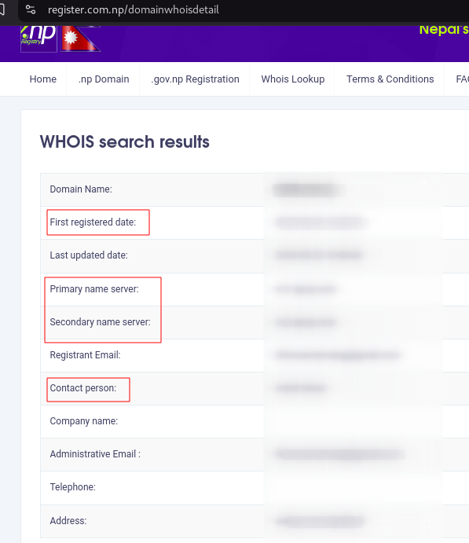

[Note: the email was blured for user privacy]

Here is a Write of the Osint Challenge ,'Ransome' from WSC CTF . 
## Description:
```
I have recently received a threatening message from an unknown person. They are asking for ransom money, otherwise, they will leak my secrets. The only information I have is a email from where i got the message.Can you find more information about the threat actor. [Email:ping@username.com.np]

Flag Format : WSC{ownerName_RegistrationDate_HostingProvider}

For example : WSC{ram_gurung_2012-06-02_NestNepal}
```
In this challenge we have to find out the name of the people who own that email, Registration date of domain and the hosting provider's name. only clue we have is the email address and domain that is related to email address.

[Note: we have taken permission from related one to use their email in challenge but I am replacing his/her name as username for user's priacy]

I tried ```whois``` tools to get info about the domain but it suggest me another site.



the tools suggest me to visit [whois-lookup](https://register.com.np/whois-lookup). I visit the platform and enter the domain name and got the all info i need to solve the challenge.



I search for the hosting server the user is using and found that it is associated with infinityfree.

So the final flag will be look like this:
```
WSC{fname_lastname_2023-05-20_infinityfree}
```