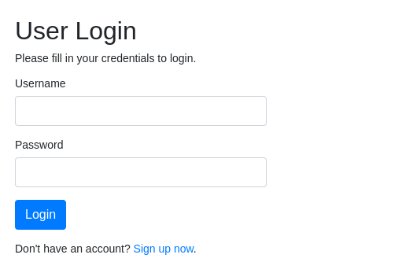
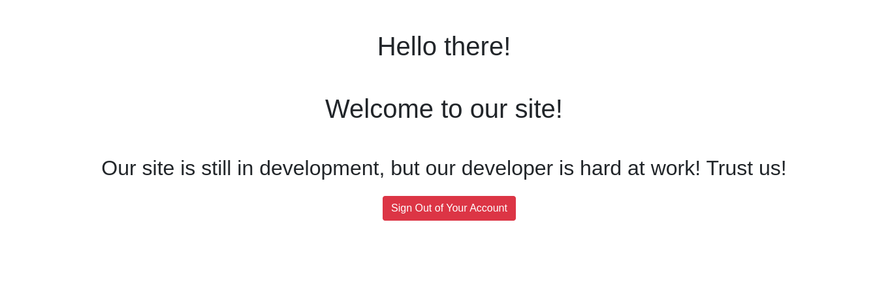
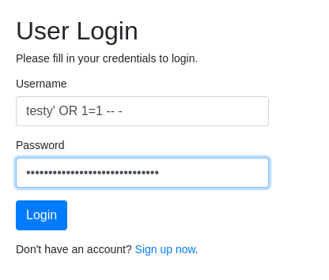
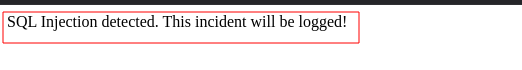
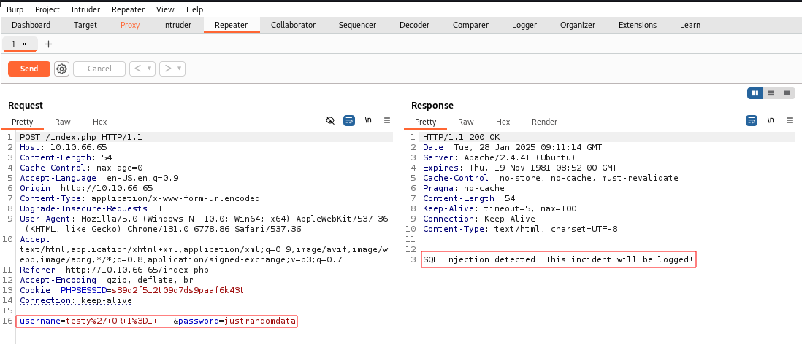
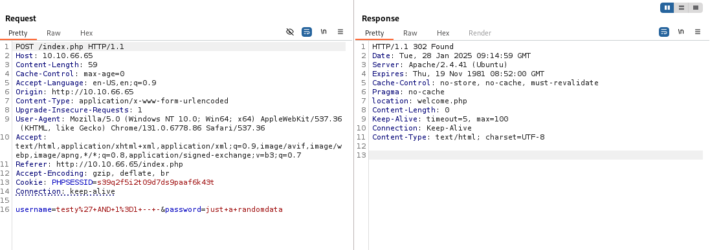

let's on the machine and start with a nmap scan on the ipaddress.
``nmap -sVC [machine ip] > nmapscan.txt`` using this command i scan the ipaddress and write it's output in ``nmapscan.txt`` file. 

### Output of the Scan :
```bash
Starting Nmap 7.95 ( https://nmap.org ) at 2025-01-28 14:26 +0545
Nmap scan report for [machine ip]
Host is up (0.19s latency).
Not shown: 998 closed tcp ports (reset)
PORT   STATE SERVICE VERSION
22/tcp open  ssh     OpenSSH 8.2p1 Ubuntu 4ubuntu0.5 (Ubuntu Linux; protocol 2.0)
| ssh-hostkey: 
|   3072 b0:c5:69:e6:dd:6b:81:0c:da:32:be:41:e3:5b:97:87 (RSA)
|   256 6c:65:ad:87:08:7a:3e:4c:7d:ea:3a:30:76:4d:04:16 (ECDSA)
|_  256 2d:57:1d:56:f6:56:52:29:ea:aa:da:33:b2:77:2c:9c (ED25519)
80/tcp open  http    Apache httpd 2.4.41 ((Ubuntu))
| http-cookie-flags: 
|   /: 
|     PHPSESSID: 
|_      httponly flag not set
|_http-server-header: Apache/2.4.41 (Ubuntu)
|_http-title: Login
Service Info: OS: Linux; CPE: cpe:/o:linux:linux_kernel

Service detection performed. Please report any incorrect results at https://nmap.org/submit/ .
Nmap done: 1 IP address (1 host up) scanned in 15.10 seconds

```
we can see port ``22`` and ``80`` are open and running ``ssh`` and ``http`` service respectively.

now lets visit the website by using the ipaddress in the browser.

we can see there is login page and I tried SQL injection or default creds like ``admin``:``admin``. but it didn't work. so i create an account using signup page and we have a username and password to login.but nothing interesting is there ,

 let's try sql injection if we can bypass the login .

[note : ``testy`` is the username i have create]

when i tried sql injection with known username we got notifications 

 so i decided to use burpsuite to intercept the request and modify it to inject sql query.
 
 let's try different version of injection using ``AND``.

 we are login successfully and we came to know the site is vulnerable to SQL injection. lets try to enumurate database and number of column by using ``ORDER BY``.
